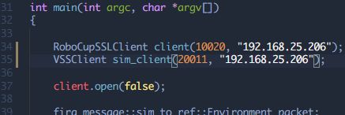

# fira-client
> Client base code #vsss #LARC #FiraSim 

## Description
This repository was created for the purpose of helping beginner teams.
This project is capable of:
- receive field and robot information from FiraSim
- Send commands to robots on FiraSim

Almost every material present here can be found at:

 [RoboCup/ssl-vision](https://github.com/RoboCup-SSL/ssl-vision)

 [Robocin/FIRASim](https://github.com/robocin/FIRASim)


Feel free to ask and contribute too :)

## Dependencies
- [protobuf](https://github.com/google/protobuf)

*Tested with: protoc 3.0.0, Ubuntu 18.04 LTS.*

## First Steps
1. If you have protobuf installed, check which version you use with the command:

```
protoc --version
````

### Installing protobuf (recommended)
If you have a debian based OS, get protobuf through apt-get:
```sh
sudo apt-get install libprotobuf-dev protobuf-compiler
```

### Installing protobuf (deprecated)
1. If you do not , follow the instructions in [C++ Installation - Unix](https://github.com/google/protobuf/tree/master/src).

1. According to its version download the referent in [protobuf/tags](https://github.com/google/protobuf/tags).

1. Extract the downloaded file and go to `/protobuf-3.0.0/src/` *(example version)*.

1. Copy the google folder and paste it into `/cpp-client/include/`

### Getting pb files
Go to folder `cpp-client/pb/proto/` and run:
```sh
sh compile.sh
```

*PS: when building the program, if something referring to `google/protobuf/stubs/common.h` has any errors, it will probably be an incompatibility version problem with protobuf (`include/google`)*.

## Usage example
1. Open the FiraSim.


1. Get the Vision multicast adress, Vision multicast port and Command listen port on FiraSim.


1. Go to `cpp-client/main.cpp` and paste the Vision Multicast port and Vision Multicast address on `RoboCupSSLClient client` initiator, respectively. Do the same
with Command listen port and Command listen address (the same of Vision Multicast address) in `VSSClient sim_client` initiator.


1. In `cpp-client/` compile the code with `make` then run:
    ```sh
    ~/fira-client/cpp-client$ make
    ~/fira-client/cpp-client$ ./vss.sim
    ```

1. To change the code and re-compile it, run `make clean` then `make` again.

## Future Work
I am planning to maintain and further improve this work. You can help me by making pull requests or by opening issues when you find any problem.
I am also planning to create a Python client. Feel free to help me.

#### Original Author: [Renato Sousa](https://github.com/renatoosousa)/Robocin (https://github.com/robocin)
#### Remake Author: [Rodrigo Caus](https://github.com/rodrigocaus)/GER Unicamp (http://www.gerunicamp.com.br/)
